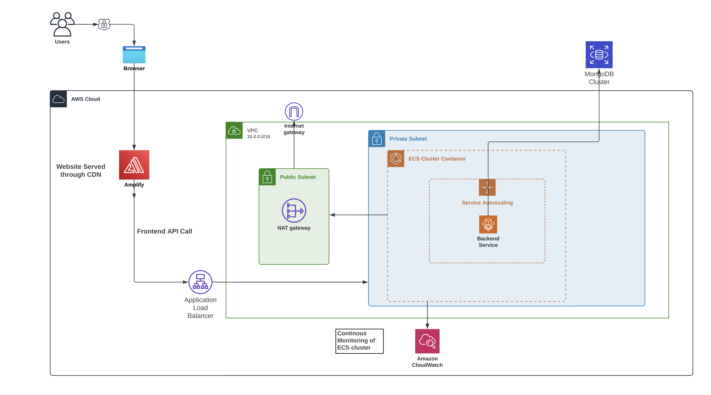

# Terraform ECS Deployment

This repository contains Terraform scripts to deploy a containerized application on **Amazon ECS (Elastic Container Service)** using a secure and scalable architecture.

---

## Overview

The infrastructure provisioned by this project includes:

- A **custom VPC** with public and private subnets
- **ECS Cluster** with tasks running in **private subnets**
- An **Application Load Balancer (ALB)** in **public subnets** to route external traffic to ECS tasks
- Supporting components like **IAM roles**, **NAT Gateway**, and **security groups**

---

## 🖼️ Architecture Diagram

